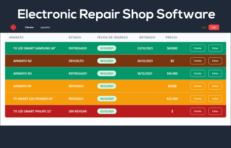
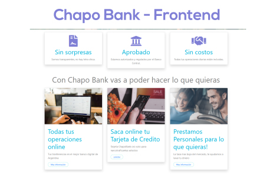

## 🚀 About Me

I'm self-taught and interested in everything related to Video, Audio, Design and Web Programming. I am a Web Developer and i am open to new challenges. For any questions send me a message and I will respond as soon as possible.

## Proyects

    <table>
	    <tr>
    	    <!-- <td style="padding:10px">
        	    
      	    </td> -->
            <td style="padding:10px">            
            	
                <a href="https://github.com/gfxargentina/taller-gestion" target="_blank" rel="noopener noreferrer">View Repo</a>
            </td>
            <td style="padding:10px">            
            	
                <a href="https://github.com/gfxargentina/chapobank" target="_blank" rel="noopener noreferrer">View Repo</a>
            </td>
        </tr>
    </table>

## 🛠 Knowledge of

| Javascript | HTML 5 | Bootstrap 4 | React | CSS | NodeJS | Express | TailwindCSS | MongoDB | NextJS | GraphQL | ApolloGraphQL | Git | Github | Adobe After Effects | Adobe Photoshop | Adobe Illustrator | Sound Forge |

## 🔗 Links

